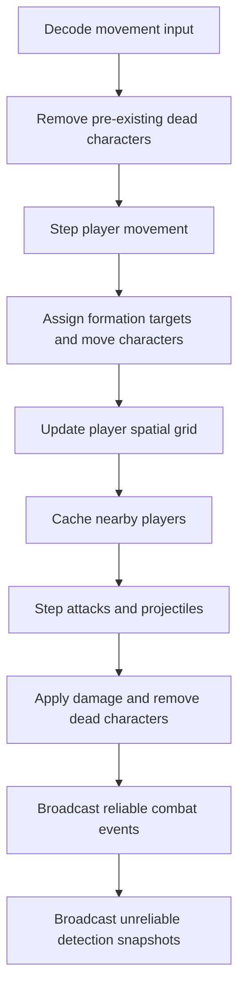

# Kiến Trúc Runtime

## Module Layout

| Package | Trách nhiệm |
| --- | --- |
| `modules/game/matchmaking` | RPC find-or-create và matchmaker callback |
| `modules/game/survival` | Nakama authoritative match lifecycle |
| `modules/game/core/entity` | Player, character, weapon và movement |
| `modules/game/core/strategy` | Strategy mask và slot formation |
| `modules/game/core/spatial` | Spatial grid cho player detection |
| `modules/game/core/combat` | Attack cycle, damage và projectile simulation |
| `modules/game/core/system` | Opcode, protobuf encoding và snapshots |
| `modules/game/core/world` | Tọa độ, spawn và world boundary |

`InitModule` đăng ký match `survival`, RPC `find_or_create_match`, matchmaker callback và RPC `healthcheck`.

## Authoritative State

Mỗi authoritative match sở hữu một `survival.State` độc lập, gồm player, presence, reservation, spatial grid, combat simulation và random source. Movement, health, formation và projectile đều do server quyết định.

State gameplay chỉ tồn tại trong memory. Nakama Storage/PostgreSQL hiện chưa lưu position, character health, formation hoặc projectile.

## Match Loop

Match chạy ở `10 Hz`, tương đương `100 ms/tick`.

Invalid opcode hoặc malformed movement payload bị bỏ qua và không dừng match.

## Lifecycle

| Callback | Hành vi chính |
| --- | --- |
| `MatchInit` | Tạo state, grid, combat simulation và label |
| `MatchJoinAttempt` | Kiểm tra join policy/capacity và giữ reservation |
| `MatchJoin` | Tạo player, character, weapon, formation và spatial entry |
| `MatchLoop` | Chạy simulation và broadcast |
| `MatchLeave` | Xóa player, presence và spatial entry ngay lập tức |
| `MatchTerminate` | Kết thúc mà không persist match state |
| `MatchSignal` | Trả state label; chưa có gameplay command qua signal |

Match rỗng tự dừng sau `60 giây` (`600 ticks`) nếu không còn player hoặc reservation.

## Dữ Liệu Và Serialization

- Realtime opcode dùng binary Protobuf.
- Matchmaking RPC request/response và match label dùng JSON.
- Weapon/strategy catalog mặc định dùng embedded JSON.
- Generated Go code được compile vào `backend.so`; `.proto`, Buf và generated C# không cần có trong runtime image.
