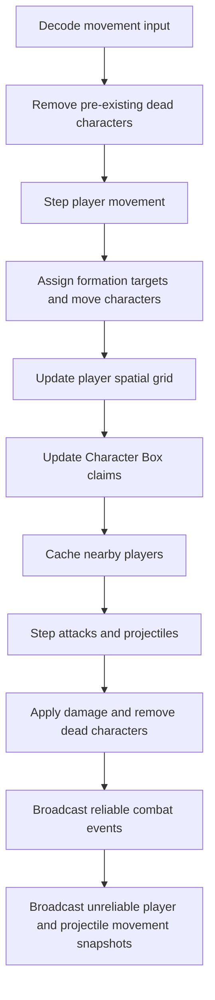
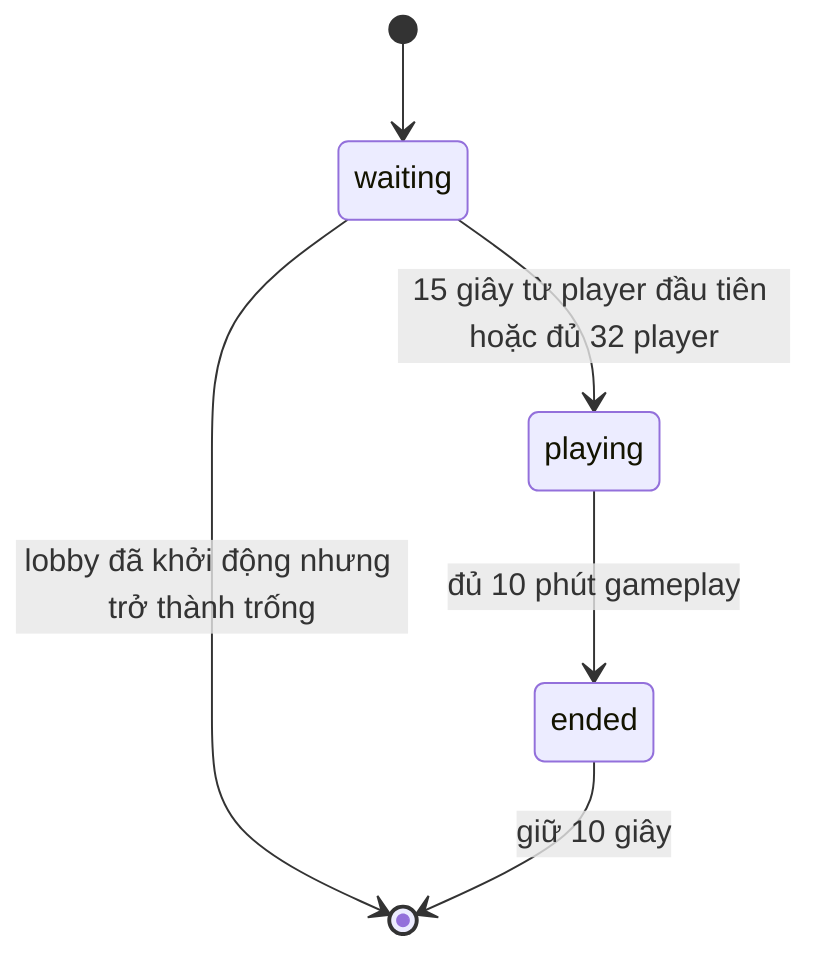

# Kiến Trúc Runtime

## Module Layout

| Package | Trách nhiệm |
| --- | --- |
| `modules/game/matchregistry` | Active user/session membership theo match |
| `modules/game/matchmaking` | RPC find-or-create và matchmaker callback |
| `modules/game/survival` | Authoritative Survival match, cho phép join-in-progress |
| `modules/game/royale` | Authoritative Battle Royale match với lifecycle `waiting → playing → ended` |
| `modules/game/core/entity` | Player, character, weapon và movement |
| `modules/game/core/strategy` | Strategy mask và slot formation |
| `modules/game/core/spatial` | Spatial grid cho player detection |
| `modules/game/core/combat` | Attack cycle, damage và projectile simulation |
| `modules/game/core/characterbox` | Claim model và embedded delay config cho Character Box |
| `modules/game/core/system` | Opcode, protobuf encoding và snapshots |
| `modules/game/core/world` | Tọa độ, spawn và world boundary |
| `modules/skin/loadout` | Đọc snapshot inventory và random character skin dùng chung cho các mode |
| `modules/account` | Khóa client profile updates và RPC đổi display name có kiểm duyệt |

`InitModule` đăng ký account hooks, match `survival`, match `battle-royale`, RPC `change_display_name`, RPC `find_or_create_match`, matchmaker callback và RPC `healthcheck`.

Active match registry được tạo một lần tại `InitModule` và dùng chung cho RPC
matchmaking cùng các Survival và Battle Royale match handler trong cùng process.

## Authoritative State

Mỗi authoritative match sở hữu state độc lập, gồm player, presence, reservation, spatial grid, combat simulation, random source và snapshot skin inventory theo session. Movement, health, formation và projectile đều do server quyết định. Combat của cả hai mode dùng player trong spatial detection làm candidate set, sau đó kiểm tra attack range chính xác giữa các character. Battle Royale bổ sung phase và deadline tick cho phòng chờ, gameplay và thời gian giữ match sau khi kết thúc.

State gameplay chỉ tồn tại trong memory. Nakama Storage/PostgreSQL hiện chưa lưu position, character health, formation hoặc projectile.

## Match Loop

Match chạy ở `10 Hz`, tương đương `100 ms/tick`. Survival chạy simulation ngay; Battle Royale chỉ chạy flow gameplay dưới đây trong phase `playing`.

```mermaid
flowchart TD
    A[Decode movement input] --> B[Remove pre-existing dead characters]
    B --> C[Step player movement]
    C --> D[Assign formation targets and move characters]
    D --> E[Update player spatial grid]
    E --> F[Update Character Box claims]
    F --> G[Cache nearby players]
    G --> H[Step attacks and projectiles]
    H --> I[Apply damage and remove dead characters]
    I --> J[Broadcast reliable combat events]
    J --> K[Broadcast unreliable player and projectile movement snapshots]
```

Invalid opcode hoặc malformed movement payload bị bỏ qua và không dừng match.

## Lifecycle

| Callback | Hành vi chính |
| --- | --- |
| `MatchInit` | Tạo state, grid, combat simulation và label |
| `MatchJoinAttempt` | Kiểm tra join policy/capacity và giữ reservation |
| `MatchJoin` | Tạo player, character, weapon, formation và spatial entry |
| `MatchLoop` | Chạy simulation và broadcast |
| `MatchLeave` | Xóa player, presence và spatial entry ngay lập tức |
| `MatchTerminate` | Kết thúc mà không persist match state |
| `MatchSignal` | Trả state label; chưa có gameplay command qua signal |

Survival và Battle Royale lobby chưa từng có player tự dừng sau `60 giây` (`600 ticks`) khi không có player hoặc reservation. Battle Royale lobby đã bắt đầu countdown sẽ dừng ngay khi trở thành trống.

### Battle Royale Lifecycle

```mermaid
stateDiagram-v2
    [*] --> waiting
    waiting --> playing: 15 giây từ player đầu tiên hoặc đủ 32 player
    waiting --> [*]: lobby đã khởi động nhưng trở thành trống
    playing --> ended: đủ 10 phút gameplay
    ended --> [*]: giữ 10 giây
```

- `waiting`: cho join và matchmaking backfill khi còn slot; movement, combat và character-box gameplay được tạm dừng.
- `playing`: khóa join, chạy cùng gameplay/config hiện tại của Survival và tính lại lịch refill character box từ tick bắt đầu.
- `ended`: khóa join, dừng simulation và chờ terminate. Vòng bo và điều kiện thắng sẽ được bổ sung sau như các điều kiện chuyển sang phase này.
- Label dùng `status=waiting|playing|ended`; chỉ lobby `waiting` có thể có `joinable=true`.
- Opcode reliable `107` (`MatchLifecycleState`) đồng bộ phase, server tick, deadline phase và tick rate cho client.

Coordinator chọn module và capacity theo `mode`: `survival.MaxPlayers` cho Survival, `royale.MaxPlayers` cho Battle Royale. Battle Royale chỉ tìm lại match có label `status=waiting`; vì vậy không backfill vào trận đang chơi.

## Dữ Liệu Và Serialization

- Realtime opcode dùng binary Protobuf; opcode `107` hiện chỉ được Battle Royale phát ra.
- `CharacterRoster` mang skin numeric ID đã được server random từ snapshot inventory lúc player join.
- Matchmaking RPC request/response và match label dùng JSON.
- Weapon/strategy catalog, combat query buffer, Character Box pickup delay và Experience Package config mặc định dùng embedded JSON.
- Generated Go code được compile vào `backend.so`; `.proto`, Buf và generated C# không cần có trong runtime image.
