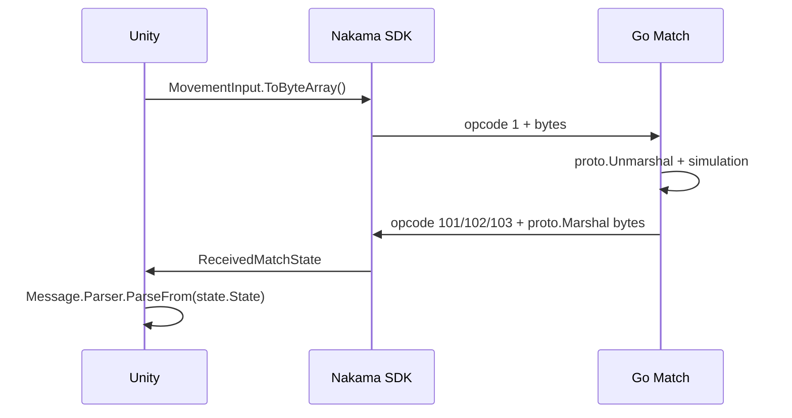

# Realtime Protocol Và Unity

## Opcode

| Opcode | Hướng | Payload | Reliability | Tần suất |
| --- | --- | --- | --- | --- |
| `1` | Client → Server | `MovementInput` | Do client chọn | Theo input |
| `101` | Server → Client | `StateSnapshot` | Reliable | Join/leave |
| `102` | Server → Client | `PlayerDetectionSnapshot` | Unreliable | Mỗi tick |
| `103` | Server → Client | `CombatEventBatch` | Reliable | Khi có event |

Contract nằm trong các source schema:

- [`input.proto`](../modules/game/core/entity/input.proto)
- [`state.proto`](../modules/game/core/system/state.proto)
- [`detection.proto`](../modules/game/core/system/detection.proto)
- [`combat.proto`](../modules/game/core/system/combat.proto)

Không đổi hoặc tái sử dụng field number đã phát hành. Field bị xóa trong tương lai cần được đánh dấu `reserved`.

## Packet Flow



Nakama SDK vận chuyển `byte[]`; Google.Protobuf chuyển giữa bytes và generated C# object.

## Unity Send

```csharp
var input = new MovementInput {
    X = direction.x,
    Y = direction.y,
    Sequence = ++sequence
};

await socket.SendMatchStateAsync(match.Id, 1, input.ToByteArray());
```

## Unity Receive

```csharp
socket.ReceivedMatchState += state => {
    switch (state.OpCode) {
        case 101:
            Handle(StateSnapshot.Parser.ParseFrom(state.State));
            break;
        case 102:
            Handle(PlayerDetectionSnapshot.Parser.ParseFrom(state.State));
            break;
        case 103:
            Handle(CombatEventBatch.Parser.ParseFrom(state.State));
            break;
    }
};
```

`CombatEvent` dùng protobuf `oneof`; Unity kiểm tra `EventCase` trước khi đọc `AttackStarted`, projectile event, damage hoặc death.

## Generate C#

Project dùng Buf remote plugins:

```powershell
buf generate
```

Go `.pb.go` được giữ trong backend repo. C# được tạo local tại `clients/unity/Generated/Protobuf` và bị Git ignore vì Unity nằm ở repo riêng; copy `Input.cs`, `State.cs`, `Detection.cs`, `Combat.cs` sang Unity sau khi schema thay đổi.

Unity cần Nakama SDK và `Google.Protobuf` runtime, không cần cài Buf hoặc `protoc` nếu chỉ sử dụng generated `.cs`.

## JSON Còn Được Dùng Ở Đâu

- RPC `find_or_create_match` request/response.
- Match label cho `MatchList` query.
- Embedded `weapons.json` và `strategies.json`.
- RPC `healthcheck` response.

Realtime opcode `1`, `101`, `102`, `103` đều dùng Protobuf binary.
