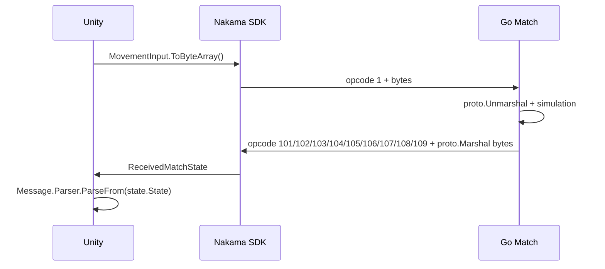

# Realtime Protocol Và Unity

## Opcode

| Opcode | Hướng | Payload | Reliability | Tần suất |
| --- | --- | --- | --- | --- |
| `1` | Client → Server | `MovementInput` | Do client chọn | Theo input |
| `101` | Server → Client | `StateSnapshot` | Reliable | Join/leave |
| `102` | Server → Client | `PlayerMovementSnapshot` | Unreliable | Mỗi tick |
| `103` | Server → Client | `CombatEventBatch` | Reliable | Khi có event |
| `104` | Server → Client | `PlayerRosterBatch` | Reliable | Join/enter detection/roster changed |
| `105` | Server → Client | `ProjectileMovementSnapshot` | Unreliable | Mỗi tick |
| `106` | Server → Client | `CharacterBoxStateBatch` | Reliable | Box spawn/despawn và pickup countdown |
| `107` | Server → Client | `MatchLifecycleState` | Reliable | Join và chuyển phase Battle Royale |
| `108` | Server → Client | `PlayerProgressionBatch` | Reliable | Join/enter detection/progression changed |
| `109` | Server → Client | `ExperiencePackageStateBatch` | Reliable | Experience package detect/lost/collected |

Contract nằm trong các source schema:

- [`input.proto`](../modules/game/core/entity/input.proto)
- [`state.proto`](../modules/game/core/system/state.proto)
- [`player_movement.proto`](../modules/game/core/system/player_movement.proto)
- [`roster.proto`](../modules/game/core/system/roster.proto)
- [`projectile_movement.proto`](../modules/game/core/system/projectile_movement.proto)
- [`vector.proto`](../modules/game/core/system/vector.proto)
- [`combat.proto`](../modules/game/core/system/combat.proto)
- [`character_box.proto`](../modules/game/core/entity/character_box.proto)
- [`character_box_state.proto`](../modules/game/core/system/character_box_state.proto)
- [`player_progression.proto`](../modules/game/core/system/player_progression.proto)
- [`experience_package.proto`](../modules/game/core/entity/experience_package.proto)
- [`experience_package_state.proto`](../modules/game/core/system/experience_package_state.proto)

Không đổi hoặc tái sử dụng field number đã phát hành. Field bị xóa trong tương lai cần được đánh dấu `reserved`.

`CharacterRoster` gửi `crit_chance`, `crit_multiplier`, `damage_reduction`; field `damage_ratio` cũ đã được `reserved`. `DamageApplied` gửi `critical` và lượng máu thực tế bị trừ trong `damage`.

## Packet Flow


```mermaid
sequenceDiagram
    participant Unity
    participant NakamaSDK as Nakama SDK
    participant Match as Go Match
    Unity->>NakamaSDK: MovementInput.ToByteArray()
    NakamaSDK->>Match: opcode 1 + bytes
    Match->>Match: proto.Unmarshal + simulation
    Match->>NakamaSDK: opcode 101/102/103/104/105/106/107/108/109 + proto.Marshal bytes
    NakamaSDK->>Unity: ReceivedMatchState
    Unity->>Unity: Message.Parser.ParseFrom(state.State)
```

Nakama SDK vận chuyển `byte[]`; Google.Protobuf chuyển giữa bytes và generated C# object.

## Unity Send

```csharp
var input = new MovementInput {
    X = direction.x,
    Y = direction.y,
    Sequence = ++sequence
};

await socket.SendMatchStateAsync(match.Id, 1, input.ToByteArray());
```

## Unity Receive

```csharp
socket.ReceivedMatchState += state => {
    switch (state.OpCode) {
        case 101:
            Handle(StateSnapshot.Parser.ParseFrom(state.State));
            break;
        case 102:
            Handle(PlayerMovementSnapshot.Parser.ParseFrom(state.State));
            break;
        case 103:
            Handle(CombatEventBatch.Parser.ParseFrom(state.State));
            break;
        case 104:
            Handle(PlayerRosterBatch.Parser.ParseFrom(state.State));
            break;
        case 105:
            Handle(ProjectileMovementSnapshot.Parser.ParseFrom(state.State));
            break;
        case 106:
            Handle(CharacterBoxStateBatch.Parser.ParseFrom(state.State));
            break;
        case 107:
            Handle(MatchLifecycleState.Parser.ParseFrom(state.State));
            break;
        case 108:
            Handle(PlayerProgressionBatch.Parser.ParseFrom(state.State));
            break;
        case 109:
            Handle(ExperiencePackageStateBatch.Parser.ParseFrom(state.State));
            break;
    }
};
```

`CombatEvent` dùng protobuf `oneof`; Unity kiểm tra `EventCase` trước khi đọc `AttackStarted`, projectile event, damage hoặc death.

`CharacterBoxStateBatch` dùng `PICKUP_STARTED` để gửi `box_id`, `claimant_session_id`, `started_at_tick` và `completes_at_tick`. Client suy ra countdown từ tick server, không chờ packet mỗi tick. `PICKUP_CANCELLED` mở khóa UI khi claimant rời vùng, chết hoặc leave; `DESPAWNED` xác nhận box đã được consume và character được grant. Các event này được broadcast reliable toàn match. Snapshot gửi lúc join gồm cả box và claim đang hoạt động.

### Roster và trạng thái render

`PlayerRosterBatch` chỉ đồng bộ metadata/static state khi player join, đi vào detection hoặc roster version thay đổi. Server không gửi roster removal riêng khi player leave match hoặc rời detection.

`PlayerProgressionBatch` tách khỏi roster và chứa `user_id`, `session_id`, `level`, `experience`, `max_experience`. `max_experience` là experience cần để lên level kế tiếp, lấy từ bảng progression; ở level 10 giá trị là `0` vì không có level kế tiếp. UI có thể hiển thị `experience / max_experience` khi `max_experience > 0` và trạng thái đạt level tối đa khi bằng `0`. Server gửi state của chính player khi join, gửi remote player khi đi vào detection và phát lại khi progression version thay đổi. Client suy ra giới hạn formation bằng `min(level, 9)`.

Khi player nhặt gói kinh nghiệm hoặc nhận XP từ kill, opcode `108` được gửi ngay trong cùng tick cho chính player và các observer đang detect player đó. Observer ngoài detection chỉ nhận trạng thái mới nhất khi đi vào detection. Player level 10 vẫn consume gói nhưng không phát progression update nếu state không đổi.

`ExperiencePackageStateBatch` opcode `109` là delta reliable theo từng observer: `DETECTED` khi gói đi vào detection radius, `LOST` khi rời detection, và `COLLECTED` khi gói đã bị nhặt. Event mang package ID, position, tier, giá trị XP thực tế; event collected mang thêm collector user/session ID.

`PlayerMovementSnapshot` opcode `102` là nguồn authoritative cho tập entity client cần render ở mỗi tick: `self` là player hiện tại và `players` là toàn bộ player khác đang trong detection. Nếu một `session_id` không còn xuất hiện trong snapshot mới, client loại player cùng các character của session đó khỏi scene. Vì movement snapshot đã đảm nhiệm visibility/despawn, roster không cần phát lại chỉ để báo leave.

## Generate C#

Project dùng Buf remote plugins:

```powershell
buf generate
```

Go `.pb.go` được giữ trong backend repo. C# được tạo local tại `clients/unity/Generated/Protobuf` và bị Git ignore vì Unity nằm ở repo riêng; copy `Input.cs`, `State.cs`, `PlayerMovement.cs`, `PlayerProgression.cs`, `ExperiencePackage.cs`, `ExperiencePackageState.cs`, `Roster.cs`, `ProjectileMovement.cs`, `Vector.cs`, `Combat.cs` sang Unity sau khi schema thay đổi.

Unity cần Nakama SDK và `Google.Protobuf` runtime, không cần cài Buf hoặc `protoc` nếu chỉ sử dụng generated `.cs`.

## JSON Còn Được Dùng Ở Đâu

- RPC `find_or_create_match` request/response.
- Match label cho `MatchList` query.
- Embedded `weapons.json`, `strategies.json` và `pickup_delays.json`.
- RPC `healthcheck` response.

Realtime opcode `1`, `101`, `102`, `103`, `104`, `105`, `106`, `107`, `108`, `109` đều dùng Protobuf binary.
